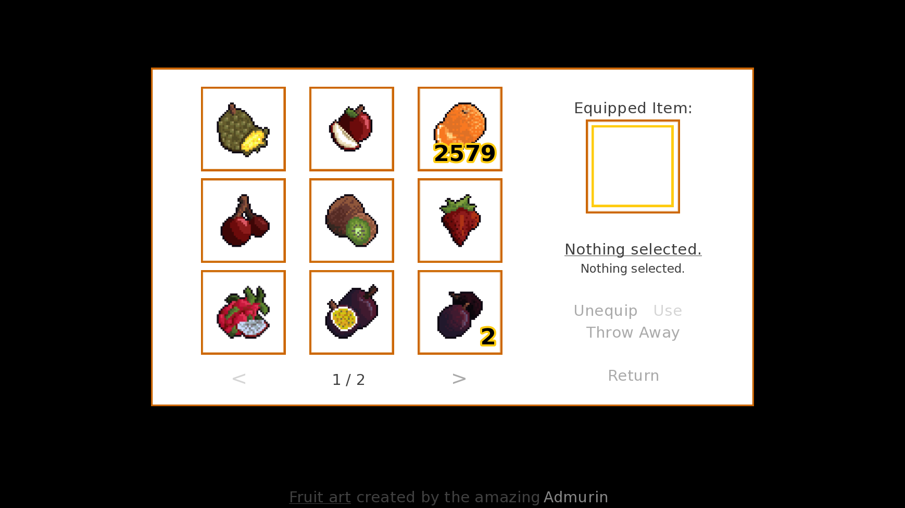

# LezInventory
## Inventory framework for Ren'Py
Ren'Py is an engine written in Python, aimed at creating (not only) visual novels.
LezInventory is an Inventory framework that anybody can take and use in their own project.

The aim of LezInventory is to be easy to work with, to customize and to understand.
It tries to do this with helpful formatting and an excessive amount of comments.



## Features of LezInventory
- Inventory object into which defined Items can be added and removed
- No limit to the amount of Inventory slots
- Stackability of Items - One Item can be stacked multiple times into one Inventory slot
- One Equip slot
- Customizable Inventory screen
- File with default settings for even faster setup

## Items without functionality
There of course have to be Items before the Inventory is of any use.
Items without functionality can be defined very simply, with the `default` statement.
All you need is a Name, a Description, and optionally an Image!
```py
default cherries = Item( "Cherries" , "Spit the seeds at your foes!" , image = "lezInventory/example_items/images/01_Cherry_Red.png" )
```
Even though the item itself doesn't do anything, it can still be tested for being in the Inventory, and story can be branched from
```py
if inventory.is_in_inventory(apple):
    "At least one apple is currently inside the inventory."
else:
    "There are no apples inside the inventory."
```

## Items with functionality
The Inventory also supports both **Usable** and **Equippable** Items.

To create one, you'll need to make a new class, but don't worry, this is easier than it sounds.
To make it super easy for you, there is a template (TODO: ADD LINK) present.
All you need to do is copy-paste it, give it a different name and put different functionality under the `equipped` and `unequipped` methods. 

For example, here is what one of the Example Items looks like:
```py
# Apple is an Equippable Item.
# When equipped, it will show a message.
# When unequipped, it will show a different message.

init -800 python:

    # Class of the Apple.
    class Apple(Item):

        # This marks the Item as equippable.
        equippable = True

        ## __init__ got ommited, as this Item doesn't take/need any extra arguments.

        # What happens when the Item is Equipped
        def equipped(self, Inventory):

            # Bring up a Notify with a custom text.
            return renpy.notify("I have been crowned the King of all Fruits!")

        # What happens when the Item is Unequipped
        def unequipped(self, Inventory):

            # Bring up a Notify with a custom text.
            return renpy.notify("Long live the king...")

# Apple defined.
default apple = Apple( "Apple" , "The King of all the fruits." , "lezInventory/example_items/images/16_Apple.png" )
```
